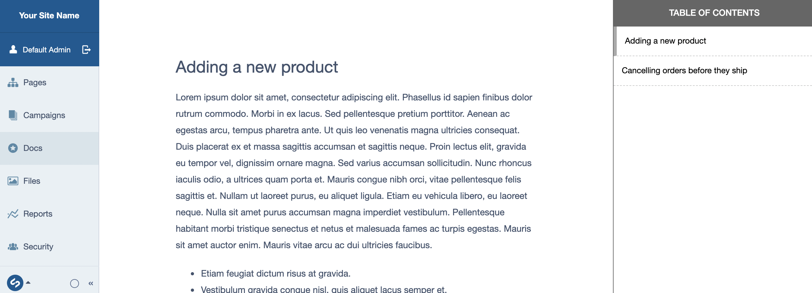

# Silverstripe Docstation module

Provides a CMS UI for browsing markdown documentation colocated with the project.



## Installation

```
composer require silverstripe/docstation
```

### Requirements

* silverstripe/graphql:4.x-dev
* PHP >= 7.4


## Example:

```
app/
  docs/
    Adding-a-Product.md
    Cancelling-an-Order.md
```

**app/docs/Adding-a-Product.md**
```
---
title: How do add a product
sort: 1
---

## Been wondering how to add a product?

This guide will give you a
* Step
* by
* step

Tutorial!

```

### Customising the documentation directory

Defaults to `app/docs`.

```
SilverStripe\Docstation\Docstation:
  docs_dir: 'app/mydocs'
```

It also supports module resolution syntax.

```
SilverStripe\Docstation\Docstation:
  docs_dir: 'somevendor/somemodule: docs'
```

### To do:

* Nested documentation, hierarchical navigation (not sure this is a great idea)
* Make it look not terrible


